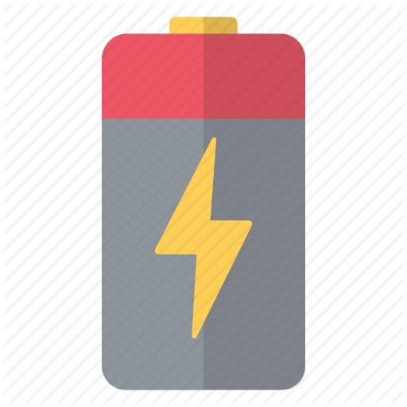
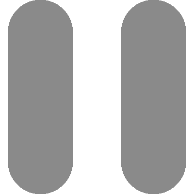
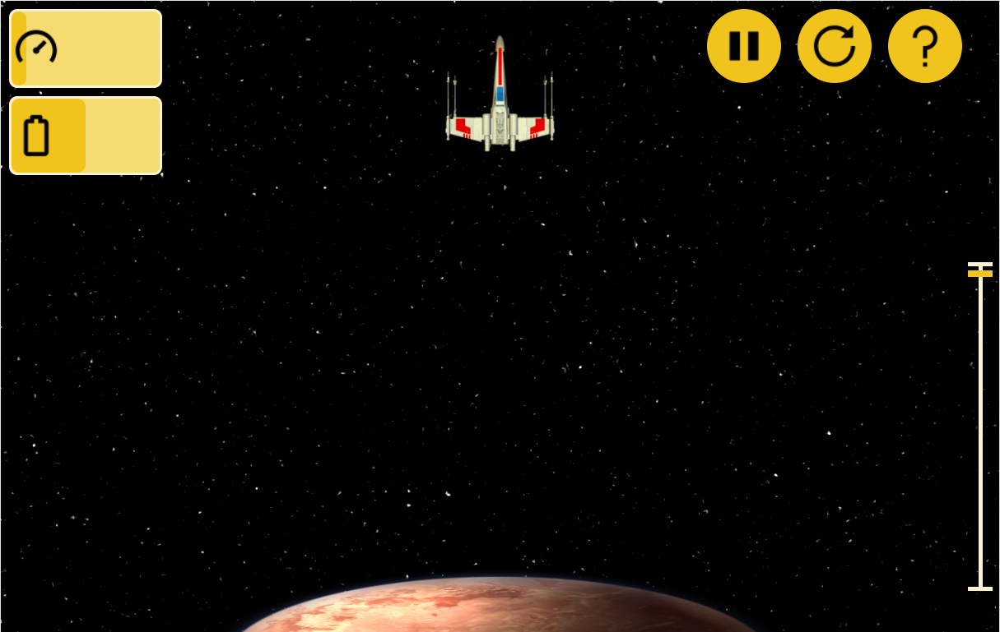
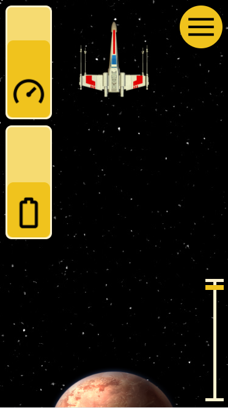

# LUNAR LANDER
Proyecto de lenguaje de marcas desarrollado en *html* y *css*.  
**Autor:** Alejandro Gayá  
**Boceto:** Djavan  
**Enlace:** Pulse [aquí](https://rawgit.com/alexgaya/LUNAR_LANDER_/master/index.html)

## Modificaciones:
El boceto carecía de contenido y explicación, así que me he visto forzado a realizar una serie de modificaciones respecto a su trabajo.

+ ##### Iconos del panel de control:
Los dos iconos estaban bien diseñados, pero estaban descargados desde una web de pago y el fondo no era transparente, así que he tenido que descargar de [aquí](https://icons8.com/) nuevos iconos gratuitos. He seleccionado iconos *material design*.  
Icono sin el fondo transparente:  
    
Nuevos iconos:  

  
+ ##### Botones:
Los botones eran de color gris, con lo cual hacían juego con los iconos pero al cambiarlos ya no quedaban bien, así que he decidido descargar de [aquí](https://icons8.com/) los nuevos botones *material design*.  
Ejemplo de botón antiguo:  
  
Nuevos botones:  

  
+ #### Función panel de control:  
La antigua función del panel de control dependía de los antiguos iconos, así que me he tomado la libertad de cambiar la función que se adapta mejor a los nuevos iconos y estéticamente es mejor. He optado por utilizar barras que se vayan llenando o vaciando según su función.  
## Resultado:  
+ #### Imagen escritorio:  
  
+ #### Imagen smartphone:  

